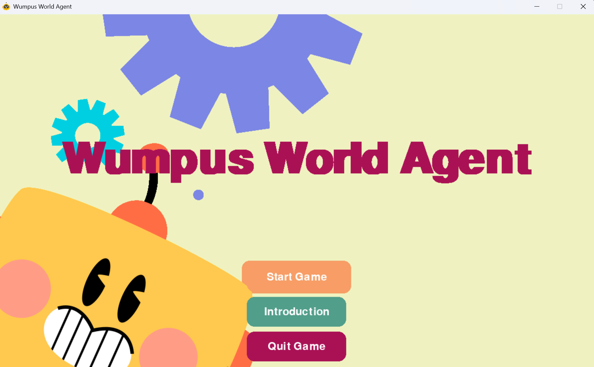

# Wumpus World Agent (Introduction to AI - HCMUS)

This project implements an intelligent agent for the classic Wumpus World problem, using propositional logic inference and search algorithms to safely navigate a grid, avoid hazards, and find the gold.

## Installation Instructions

1. **Navigate into this project folder**:
	Example: D:\vs_code\AI_wumpus

2. **Install Python dependencies:**
	```powershell
	pip install -r requirements.txt
	```

## How to Run

### 1. Console Mode (Fast Check)

Run the following command to start the agent in console mode:

```terminal
py source/main.py
```

You will be prompted to enter:
- World size (default: 8)
- Number of Wumpus (default: 2)
- Pit probability (default: 0.2)
- Random Agent (y/n)
- Moving Wumpus (y/n)

**Expected Output:**
- The console will display the game symbols, agent's actions, percepts, and world state after each move.
- At the end, you will see the final score and number of actions taken.

Example:
```
=== GAME STARTED ===
Game Symbol Definition:
  Pit        : 🫓
  Breeze     : 💨
  Wumpus     : 👻
  Stench     : 💩
  Gold       : 🥇
  Agent      : 🤖
  Safe       : ✅
  Dangerous  : ❌
  Visited    : 👁️

🏚️ Agent's current location: (0, 0)
↗️ Agent's current direction: RIGHT
🦾 Action selected: MOVE_FORWARD
💯 Score: 0
🪙 Gold: False
🏹 Arrow: True
🧠 Percepts: {'stench': False, 'breeze': False, ...}
... (game continues) ...
🎯 Game Over!
💯 Final Score: 950
Number of actions: 18
```

### 2. GUI Visualization

To run the graphical interface, use:

```powershell
py source/visualization.py
```

**Features:**
- Interactive setup for world size, number of Wumpus, pit probability, random agent, and moving Wumpus.
- Visual display of the grid, agent, Wumpus, pits, gold, and percepts.
- Step-by-step animation of the agent's reasoning and actions.
- Game symbols and legend for easy understanding.

**Expected Output:**
- A window will open showing the Wumpus World grid and agent.
- Use the menu to start the game, view introduction, or quit.
- The agent's actions, score, and percepts are displayed in real time.  
You should expect a screen like this appear:



## Project Structure

- `source/` - Source code for agent, world, logic, and visualization.
- `source/main.py` - Console mode entry point.
- `source/visualization.py` - GUI mode entry point.
- `source/generate_testcase.py` - Code to auto generate testcase with random configurations.
- `source/experiments.py` - Code to run experiments to compare with random baseline.
- `assets/` - Images and sounds for GUI.
- `testcases/` - Testcases with map input configurations and output results.
- `experiments/` - Experiments results with world configurations and each agent's statistics.
- `requirements.txt` - Python dependencies.